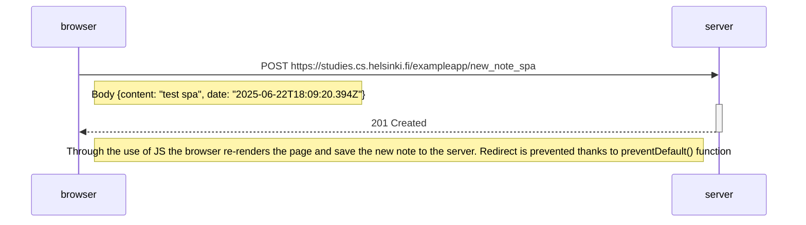

```mermaid
sequenceDiagram
    browser->>server: POST https://studies.cs.helsinki.fi/exampleapp/new_note_spa
    Note right of browser: Body {content: "test spa", date: "2025-06-22T18:09:20.394Z"}
    activate server
    server-->>browser: 201 Created
    deactivate server
    Note right of browser: Through the use of JS the browser re-renders the page and save the new note to the server. Redirect is prevented thanks to preventDefault() function
```
